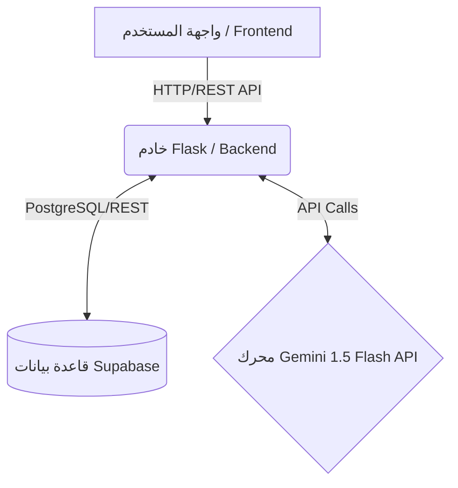
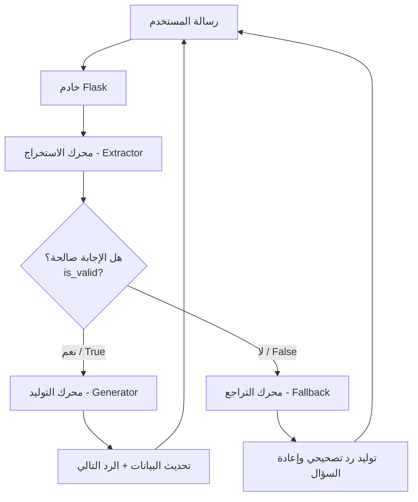
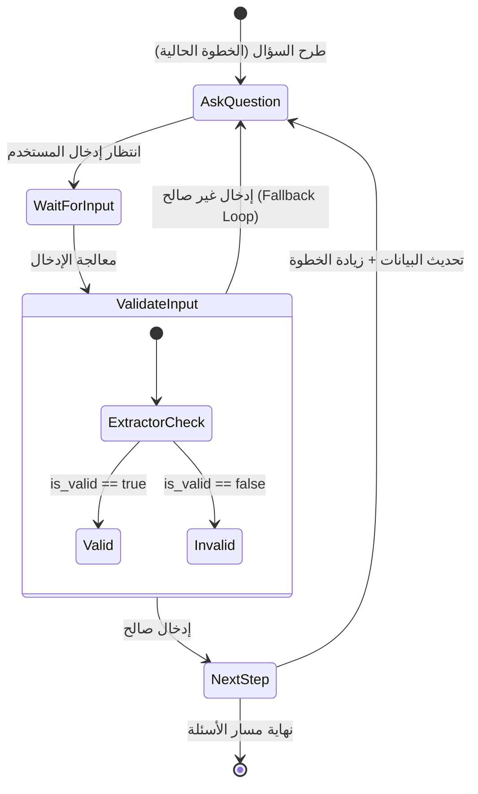
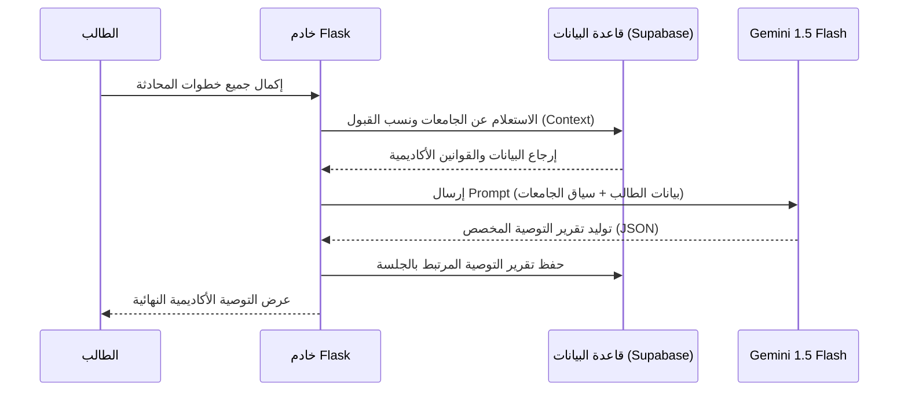
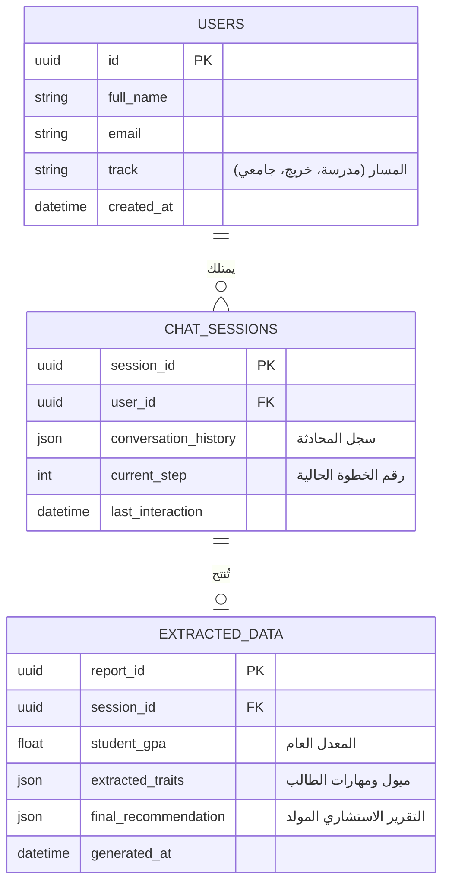

# وثيقة التصميم الهندسي والتقني لمشروع "مسار"
(Masar Comprehensive Technical Architecture)

## مقدمة
مشروع "مسار" هو منصة استشارية أكاديمية ذكية تستهدف توجيه الطلاب (في المراحل المدرسية، الجامعية، والخريجين) نحو المسار التعليمي والمهني الأنسب لهم. يعتمد النظام على تفاعل حواري ذكي مدعوم بنماذج الذكاء الاصطناعي التوليدي، مع دمج بيانات حقيقية لضمان تقديم توصيات دقيقة ومبنية على أسس واقعية تتناسب مع البيئة التعليمية اليمنية.

تستعرض هذه الوثيقة البنية التحتية، الخوارزميات، وهندسة النظام التي بُني عليها المشروع لتكون مرجعاً أكاديمياً وتقنياً.

---

## 1. نظرة عامة والمكدس التقني (Tech Stack & Architecture)

تم تصميم "مسار" ليكون نظاماً قابلاً للتطوير، سريع الاستجابة، وفعالاً من حيث التكلفة، مع الاعتماد على التقنيات التالية:

* **Backend:** Python / Flask - تم اختياره لمرونته العالية، وسهولة بناء واجهات برمجة التطبيقات (APIs)، بالإضافة إلى الدعم القوي لمكتبات الذكاء الاصطناعي ومعالجة البيانات.
* **Database:** Supabase / PostgreSQL - لتوفير قاعدة بيانات علائقية قوية، قابلة للتطوير، مع الاستفادة من ميزات الوقت الفعلي (Real-time).
* **AI Engine:** Google Gemini 1.5 Flash - يعتمد النظام بشكل أساسي على هذا النموذج للأسباب التالية:
  * **السرعة العالية (Low Latency):** ضرورية لتطبيقات المحادثة التفاعلية لتجنب فترات الانتظار الطويلة.
  * **دقة مخرجات الـ JSON:** قدرة النموذج الفائقة على الالتزام الصارم بهياكل البيانات (JSON Schemas)، مما يسهل استخراج المتغيرات برمجياً.
  * **التكلفة الفعالة:** يوفر النموذج أداءً ذكياً وتوليداً دقيقاً بتكلفة مدروسة ومناسبة للمشاريع القابلة للتوسع.

### المخطط المعماري للنظام (System Architecture)

---

## 2. هندسة المحادثة المزدوجة (The Dual-Prompt Architecture)

لضمان دقة استخراج البيانات وتجنب التشتت أو الهلوسة أثناء المحادثة، تم تصميم معمارية تعتمد على فصل مهام الذكاء الاصطناعي إلى محركين منفصلين يعملان بشكل متتابع (Pipeline):

1. **محرك الاستخراج (Extractor Engine):**
   وظيفته تحليل إجابة المستخدم في سياق السؤال المطروح. يقوم المحرك بتقييم النص وإرجاع حالة تحقق منطقية (`is_valid: true/false`) بالإضافة إلى استخراج البيانات المطلوبة (مثل: المعدل، الاهتمامات، أو المهارات) بصيغة مُهيكلة.
   
2. **محرك التوليد (Generator Engine):**
   يتلقى مخرجات محرك الاستخراج. وبناءً على النتيجة السابقة، يقوم بتوليد الرد التفاعلي المناسب وتوجيه مسار المحادثة بأسلوب إرشادي ذكي.

### مخطط التدفق لرحلة رسالة المستخدم (Flowchart)

---

## 3. خوارزمية آلة الحالة ومعالجة الأخطاء (State Machine & Fallback Loop)

تُدار المحادثة في الـ Backend باستخدام آلية "آلة الحالة" (State Machine)، حيث يتم تتبع تقدم المستخدم عبر خطوات مرقمة ومحددة سلفاً (Steps)، مما يمنع الذكاء الاصطناعي من الخروج عن المسار المخطط له.

* **التقدم الناجح:** عندما يجيب المستخدم ببيانات صالحة، يتم تخزين المعلومات المستخرجة في حالة الجلسة (Session State)، وينتقل النظام إلى الخطوة التالية منطقياً (Increment Step).
* **حلقة التراجع (Fallback Loop):** تُعنى هذه الخوارزمية بمعالجة المدخلات العشوائية أو غير المفهومة (مثل "كيف يعني؟"، أو إرسال رموز تعبيرية). في هذه الحالة:
  1. يُرجع الـ Extractor قيمة `is_valid: false`.
  2. يمنع الـ Backend زيادة عداد الخطوات (No Step Increment).
  3. يتم توجيه الـ Generator لصياغة رد تصحيحي يعيد صياغة السؤال السابق بطريقة أوضح لضمان حصول النظام على المعلومة المطلوبة.

### مخطط الحالة (State Diagram)

---

## 4. نظام التوصية وحقن البيانات (RAG & Recommendation Logic)

لمنع الذكاء الاصطناعي من "الهلوسة" بتقديم معلومات أكاديمية خيالية أو غير دقيقة، تم تطبيق تقنية مقاربة للـ (Retrieval-Augmented Generation - RAG).

* **الآلية:** فور انتهاء المحادثة وتجميع كافة بيانات الطالب (المعدل التراكمي، الميول، المهارات)، يقوم الـ Backend بتنفيذ استعلام في قاعدة البيانات لجلب **الجامعات اليمنية، التخصصات المتاحة، ونسب القبول الحقيقية** المتوافقة مع حالة الطالب.
* **التوليد:** تُمرر هذه البيانات الواقعية كسياق (Context) ضمن الـ Prompt النهائي لنموذج Gemini، مما يضمن أن التقرير المُولد يتضمن توصيات حقيقية، شروط قبول دقيقة، وتوجيهات مبنية على الواقع المتاح للطالب.

### المخطط التتابعي (Sequence Diagram)

---

## 5. تحليل الشهادات البصري (Vision & OCR Integration)

لتعزيز دقة إدخال البيانات، يوفر "مسار" تقنية متقدمة تسمح للطلاب برفع صور شهاداتهم المدرسية أو الأكاديمية.
يتم توظيف قدرات الرؤية الحاسوبية المدمجة في Gemini (Gemini Vision Capabilities) لتحليل الصورة على النحو التالي:
1. إرسال الصورة إلى واجهة Gemini API مع Prompt مخصص للقراءة البصرية (OCR).
2. استخراج وفهم الجداول والدرجات المدونة في الوثيقة.
3. استخلاص **المعدل التراكمي العام (GPA)** آلياً بدقة عالية، مما يختصر وقت المستخدم ويمنع أخطاء الإدخال اليدوي، ليكون نقطة الانطلاق في جلسة التوجيه.

---

## 6. مسارات المستخدمين (User Tracks Logic)

يقدم النظام رحلة استشارية مخصصة بالكامل تعتمد على الشريحة التي ينتمي إليها المستخدم، حيث تم تصميم استراتيجية أسئلة محددة لكل مسار:

1. **مسار طالب المدرسة (School Student):** 
   * **الهدف:** التحفيز واستكشاف الشغف المبكر.
   * **الاستراتيجية:** تركز الأسئلة على المواد المدرسية المفضلة، الأنشطة اللامنهجية، والميول الشخصية لمساعدة الطالب على استكشاف المجالات الواسعة التي تناسبه.
   
2. **مسار الخريج - ثانوية عامة (Graduate):**
   * **الهدف:** القبول الجامعي واختيار التخصص المناسب.
   * **الاستراتيجية:** أسئلة مباشرة وحاسمة تتعلق بالمعدل النهائي المحقق، الميزانية المالية المتاحة للدراسة، وتفضيلات الموقع الجغرافي، بهدف مطابقته مع الجامعات المتاحة.
   
3. **مسار الطالب الجامعي (University Student):**
   * **الهدف:** التطور المهني وتعزيز التنافسية في سوق العمل.
   * **الاستراتيجية:** مناقشة التخصص الحالي للطالب، المهارات التقنية والناعمة التي يمتلكها، مع تقديم إرشادات حول الشهادات الاحترافية ومجالات العمل المستقبلية.

---

## 7. هيكلية قاعدة البيانات وواجهات الـ API (Database & API Schema)

تتسم قاعدة البيانات في Supabase بهيكلية علائقية مرنة لربط المستخدمين بجلساتهم وتقاريرهم.

**أبرز نقاط الوصول (API Endpoints) في خادم Flask:**
* `POST /chat` : الواجهة المركزية لاستقبال رسائل المستخدم ومعالجتها ضمن خوارزمية الـ State Machine.
* `POST /upload_certificate` : لاستقبال ومعالجة صور الشهادات واستخراج المعدل بفضل الـ Vision AI.
* `GET /recommendations` : لجلب تقارير التوجيه المكتملة وعرضها للمشرفين في لوحة التحكم (Dashboard).

### مخطط علاقات الكيانات (ER Diagram)

